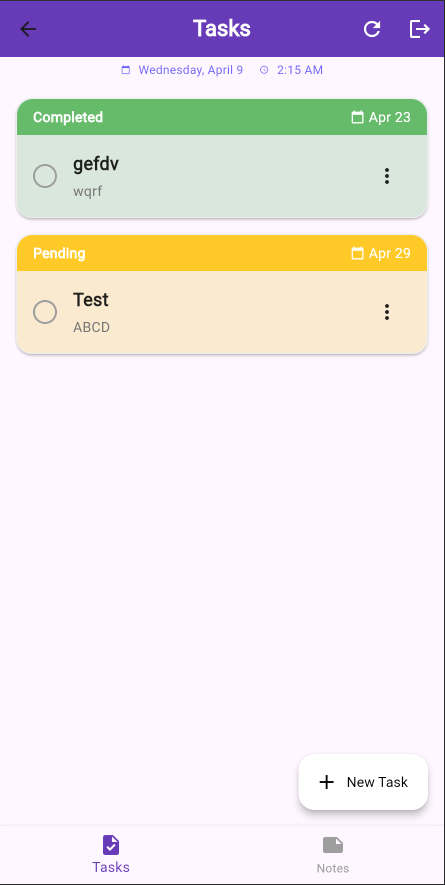
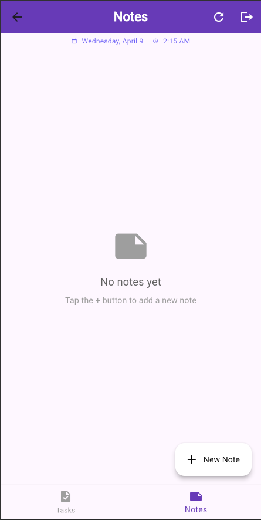
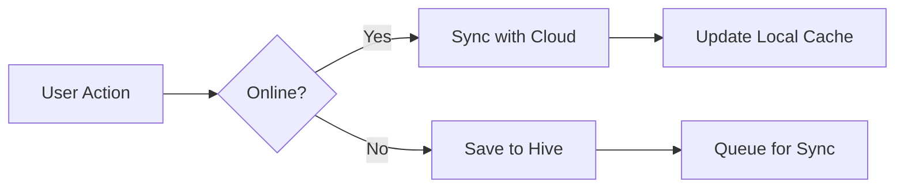

# Task & Note Manager

<style>
   .container{
      display: flex;
      flex-direction: row;
      height: 500px;
      overflow: auto;
      gap: 10px;
   }
</style>
<div class="container">
  
  
</div>

<br/>

A beautifully designed Flutter application for managing tasks and notes with seamless offline-first architecture and military-grade authentication.

## ✨ Key Features

### Core Capabilities
- **Dual Functionality**: Unified interface for tasks and notes
- **Modern UI**: Clean Material Design with intuitive interactions
- **Rigid Authentication**: Multi-layer security with offline fallback

### Task Management
- **Full Lifecycle Tracking**: Create/edit tasks with deadlines
- **Visual Status Indicators**: Color-coded (Pending/In Progress/Completed)
- **Smart Sync**: Offline edits auto-sync when back online

### Note System
- **Rich Content**: Text formatting with timestamps
- **Instant Save**: Changes persist immediately locally
- **Version Safety**: Conflict-free cloud synchronization

### Security
- **Military-Grade Auth**: Hardened credential validation
- **Device Fingerprinting**: Unique device ID tracking
- **Time-Limited Offline**: Automatic logout after 24hrs offline

## 🚀 New Offline-First Architecture

### Data Flow


### Sync Features
- **Intelligent Conflict Resolution**: Last-write-wins strategy
- **Change Queuing**: Offline operations execute when reconnected
- **Bandwidth Optimization**: Delta updates only

## 🏗️ Enhanced Architecture

### Frontend (Flutter)
- **State Management**: Hybrid setState + Hive for offline
- **Local Cache**: Hive DB for instant offline access
- **Sync Engine**: Background synchronization
- **Security Layer**: JWT refresh with offline validation

### Backend (Django)
- **Hardened Auth**: Rigid credential checking middleware
- **Device Registry**: Tracks authorized devices
- **Atomic Operations**: Guaranteed data consistency
- **Audit Logging**: All changes timestamped

## 🛠️ Upgraded Technical Stack

| Component               | Technology                          |
|-------------------------|-------------------------------------|
| **Frontend**            | Flutter 3.x                         |
| **Backend**             | Django 4.x + DRF + JWT              |
| **Local Database**      | Hive (encrypted boxes)              |
| **State Management**    | Provider + Hive                     |
| **Networking**          | Dio with retry logic                |
| **Security**            | JWT + Device Fingerprinting         |
| **Sync Engine**         | Connectivity-aware background tasks |

## 🔐 Authentication Flow

1. **Secure Login**:
   - Rigid credential validation
   - JWT token issuance
   - Device registration

2. **Offline Access**:
   - Time-limited session (24hrs)
   - Local credential verification
   - Automatic logout on expiry

3. **Continuous Validation**:
   - Token refresh rotation
   - Silent re-authentication
   - Device anomaly detection

## 🌟 Why This Stands Out

- **Battle-Tested Security**: Military-grade auth with offline fallback
- **Bulletproof Sync**: Never lose data, even with spotty connections
- **Enterprise Ready**: Audit logging and device tracking
- **Optimized Performance**: Local cache = instant UI response

## 📱 Enhanced Screens

1. **Login Screen**: With device trust indicators
2. **Offline Mode**: Clear network status indicators
3. **Sync Status**: Visual queue progress
4. **Security Settings**: Device management

## 🔮 Roadmap

- [x] Offline-first architecture
- [x] Military-grade authentication
- [ ] End-to-end encryption
- [ ] Biometric unlock
- [ ] Cross-device sync conflict UI
- [ ] Audit log viewing

<div class="container">
  
  
</div>
```
